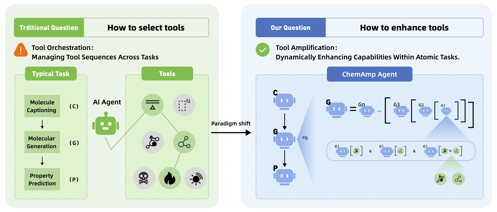

<p align="center">
  
  <!-- <a href="https://arxiv.org/abs/XXXX.XXXXX"></a> -->
  
</p>

# ChemAmp: Amplified Chemistry Tools via Composable Agents

English | [中文](README_zh.md)

Our work is accepted at **ACL 2026 Findings**.

> **TL;DR:** Tool amplification via ChemAmp: Dynamically coordinate chemistry tools for SOTA results + 94% inference cost reduction with ≤10 samples.

## Overview

Large Language Models (LLMs) have shown promising potential in chemistry, yet their performance is often limited by the lack of domain-specific knowledge and the inability to leverage specialized chemistry tools effectively. Existing approaches typically rely on a single tool or a fixed tool pipeline, failing to exploit the complementary strengths of different chemistry models.

We present **ChemAmp** (Chemical Amplified Chemistry Tools), a novel stacking framework that addresses this challenge:

- **Warmup Evaluation**: Each candidate chemistry tool is individually evaluated on a training subset to assess its task-specific capability.
- **Hierarchical Stacking**: Top-performing tools are combinatorially composed into hierarchical agent structures, where agents can use other agents as tools, enabling deep tool collaboration.
- **Multi-Agent Topologies**: Supports diverse multi-agent communication patterns (Chain, Star, Layered, Debate, FullConnected, Random) for flexible agent orchestration.

## Method



## Project Structure

```
ChemAmp/
├── main.py                          # Main entry point for stacking framework
├── Multiagent.py                    # Multi-agent topology experiments
├── ablation.py                      # Ablation study experiments
├── requirements.txt                 # Python dependencies
├── template.env                     # API configuration template
├── Stacking_agent/
│   ├── agent.py                     # ReAct-based agent implementation
│   ├── Basemodel.py                 # Chat model wrapper (Azure OpenAI, DashScope)
│   ├── Stacking.py                  # Core stacking algorithm
│   ├── generator.py                 # Tool composition generator
│   ├── warmup.py                    # Warmup phase for tool evaluation
│   ├── Tool.py                      # Tool interface
│   ├── utils.py                     # Evaluation metrics (BLEU, ROUGE, etc.)
│   ├── prompt/                      # Prompt templates
│   │   ├── ReAct_prompt.py
│   │   └── MultiAgent_prompt.py
│   └── tools/                       # Chemistry tools
│       ├── Name2SMILES.py           # Molecule name → SMILES (PubChem)
│       ├── SMILES2Property.py       # SMILES → molecular properties
│       ├── SMILES2Description.py    # SMILES → text description
│       ├── Chemformer.py            # Reaction prediction model
│       ├── ChemT5.py                # ChemT5 model
│       ├── DFM.py                   # ChemDFM model
│       ├── Unimol.py                # UniMol molecular model
│       ├── Agent_tool.py            # Nested agent tool
│       ├── Chat_agent.py            # Chat-based agent tool
│       ├── FinalRefer_agent.py      # Final reference agent
│       ├── llama.py                 # Llama model integration
│       └── deepseek.py              # DeepSeek model integration
├── Dataset/
│   ├── Molecule_Design/             # Molecule design (description → SMILES)
│   ├── Molecule_captioning/         # Molecule captioning (SMILES → description)
│   ├── ReactionPrediction/          # Reaction prediction
│   └── MolecularPropertyPrediction/ # Property prediction (BACE, BBBP, ClinTox, HIV, Tox21)
└── png/
    └── Intro.png
```

## Quick Start

### Installation

```bash
conda create -n ChemAmp python=3.10
conda activate ChemAmp
pip install -r requirements.txt
```

### Configuration

Copy `template.env` to `.env` and fill in your API keys:

```bash
cp template.env .env
```

| Parameter | Description |
|---|---|
| `AZURE_API_KEY` | Azure OpenAI API key (for GPT-4o) |
| `AZURE_API_ENDPOINT` | Azure OpenAI endpoint URL |
| `AZURE_API_VERSION` | Azure OpenAI API version |
| `ALI_API_KEY` | Alibaba DashScope API key (for Llama3 / DeepSeek-R1) |

If you use other API providers, modify `Stacking_agent/Basemodel.py` accordingly.

### Adding Custom Tools

Create a new `.py` file in `Stacking_agent/tools/` and register it in `Stacking_agent/generator.py`:

```python
self.tool_mapping = {
    ...
    'YourNewTool': 'YourNewTool("param")'
    ...
}
```

### Default Hyperparameters

The framework uses GPT-4o (May 2024) as the default ReAct controller. Key hyperparameters:

| Parameter | Default | Description |
|---|---|---|
| `δ` | 0.05 | Improvement threshold for adding a new stacking layer |
| `top-k` | 5 | Branching factor in Stage 2 (number of candidate compositions) |
| `train_data_number` | 10 | Validation samples per task (≤10 suffices) |

### Run the Stacking Framework

```bash
python main.py --Task "ReactionPrediction" --tools "[SMILES2Property(),Chemformer()]" --topN 5 --tool_number 2 --train_data_number 20
```

You can also specify a custom stacking structure directly (skip training):

```bash
python main.py --Task "Molecule_Design" --no_train --Stacking "['ChemDFM_1','Name2SMILES_0']" --topN 5 --tool_number 2 --train_data_number 10
```

### Ablation & Multi-Agent Experiments

```bash
# Ablation on stacking parameters
python ablation.py --Task "Task" --tools "tools" --topN topN --tool_number tool_number

# Multi-agent topology experiments (Chain / Star / Layered / Debate / FullConnected / Random)
python Multiagent.py --mode Chain --agents 0 --no_tool True
```

## Supported Tasks

| Task | Input | Output | Metrics |
|---|---|---|---|
| Molecule Design | Text description | SMILES | Exact Match, Validity, BLEU-2, MACCS/RDK/Morgan FTS |
| Molecule Captioning | SMILES | Text description | BLEU-2/4, ROUGE-2/4/L, METEOR |
| Reaction Prediction | Reaction equation | Product SMILES | BLEU-2 |
| Molecular Property Prediction | SMILES | Yes/No | AUC-ROC |

<!-- ## Citation

If you find this work useful, please cite:

```bibtex
@inproceedings{zhang2026chemamp,
      title={ChemAmp: Amplified Chemistry Tools via Composable Agents},
      author={Bowei Zhang and ...},
      year={2026},
      booktitle={Findings of the Association for Computational Linguistics: ACL 2026},
}
``` -->


## License

This project is licensed under the MIT License. See [LICENSE](LICENSE) for details.
